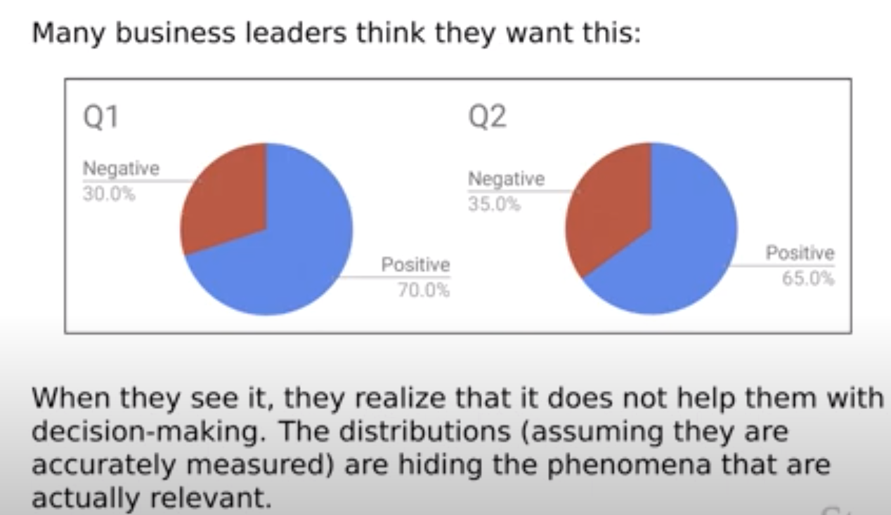

### Agenda 

Session 1. Introduction to Sentiment Analysis (12/6)

Session 2. Sentiment Analysis & Modeling in R (13/6)

### Materials 

Available from:

- https://github.com/jameswrbrookes/ccbs-sentiment-analysis-tutorial-r.git

# Introduction to Sentiment Analysis 

## What is Sentiment Analysis?

### What is Sentiment Analysis?

- Task/research field in Natural Language Processing (NLP) since ca. 2000

- Is this piece of language positive or negative in sentiment? 

- ``Sentiment analysis, also called opinion mining, is the field of study that
analyzes people’s opinions, sentiments, appraisals, attitudes, and emotions
toward entities and their attributes expressed in [language]. The entities can
be products, services, organizations, individuals, events, issues, or topics.'' (Liu 2020) 

- Usually written text, but also work being done using different types of input data: images, videos, and audio  

- Other names (but subtly different tasks): opinion mining, opinion analysis, opinion extraction, sentiment mining, subjectivity analysis, affect analysis, emotion analysis, and review mining 

### Task Setup

- Most typically a simple binary classification task: positive vs. negative 
- Occasionally ordinal (e.g. star ratings; negative/neutral/positive; very negative---very positive; etc.) 
- More complex tasks (see later):
  * What type of attitude is conveyed by this text?
  * To what degree? 

## Applications 

### General

- businesses:
  * what are customers saying about their products and services? 
- consumers:
  * product reviews used to rank products and merchants (McGlohon et al. 2010)
- governments and decision-making institutions:
   * what are public opinions about existing or proposed policies? 
- political elections (e.g., Bermingham and Smeaton 2011)
  * what are people's opinions about electoral candidates? 

  
### CB & EconFin

- stock market prediction (Das and Chen 2007)
- regulatory communications to firms in distress (work with David Bholat)
- sentiment gap between market participants' views and those of the MPC (work with Carlos Canon)
- measuring news sentiment (Turrell et al.; Shapiro et al.)  

### Example: Product/Service Reviews (1)

\begin{figure}
  \includegraphics[width=7.5cm]{images/suitcase.png}
\end{figure}

### Example: Product/Service Reviews (1)

\begin{figure}
  \includegraphics[width=7.5cm]{images/hotel.png}
\end{figure}

### Example: Measuring Consumer Confidence

Is tweet sentiment a leading indicator of polls? (O'Connor et al. 2010)

\begin{figure}
  \includegraphics[width=7.5cm]{images/oconnor2010.png}
\end{figure}

### Example: Stock Market Prediction 

Does tweet sentiment predict DJIA? (Bollen et al. 2011)

\begin{figure}
  \includegraphics[width=7.5cm]{images/bollen2011.png}
\end{figure}

### Stuff that Falls Under Sentiment Analysis

- subjectivity detection (Pang and Lee 2004) 
- hawkishness/dovishness (Tobback et al. 2017)
- toxic language detection (Zhou et al. 2021)
- fake news detection  (Oshikawa et al. 2020)
- stance detection (Anand et al. 2011) 
- rumor detection (Ma et al. 2018) 
- polarization (Demszky et al. 2019)

## Levels of Sentiment Analysis

### Document Level

- classify whether a whole document expresses a positive or negative sentiment 
- e.g. given a product review, the sentiment analysis system determines whether the whole review expresses an overall positive or negative opinion about the product
- problem:
    * assumes each document is about a single entity
    * so difficult to extract reasons 

<!-- {width = 20%}  -->

\begin{figure}
  \includegraphics[width=7.5cm]{images/doc-sent-pie-charts.png}
\end{figure}

(image due to Chris Potts, Stanford CS224U)

### Sentence Level

- classify whether a sentence expresses a positive, neutral, or negative opinion 
- similar problems as with document-level analysis:
    * e.g. *The food arrived cold, but the service was fast*
    

### Aspect (Target/Feature/Entity) Level

- often want to know what each sentiment/opinion is about 

- takes a document and extracts all (aspect, sentiment) pairs 
    * e.g. *Apple is doing well in this poor economy*
        * (Apple, positive), (economy in general, negative)
        
- or we could go even more fine-grained
    * e.g. ``When I arrived, I was so upset with the manager of the hotel''
      +  entity - hotel
      + stimulus - manager of the hotel
      + emotion - anger
      + experiencer - the speaker/writer
      + time - upon arrival 
      
- problem:
    * a bit more involved, need two systems - one to extract aspects, another to classify sentiment 

## Issues in Sentiment Analysis

### Affective Computing 

\begin{figure}
  \includegraphics[width=10cm]{images/sudhof-et-al.png}
\end{figure}

(Sudhof et al. 2014)

### Language Use

1. There was an earthquake in California / on Mars 
2. This tune / person is sick 
3.
  + Can you recommend a good camera?
  + Do you know some place I can get this rubbish camera fixed?  
4. This camera cost an arm and a leg 
5. Many consider this movie bewildering, boring, slow-moving, or annoying [...]  It was the best movie I have ever seen. 
6. Coke tastes better than Pepsi 
7. The team failed to complete the challenge. (We win/lose!)
8. I'm so upset that XYZ Firm's share price has gone up

### Negation

- Consider:
 + I really like this movie
 + I really did**n't** like this movie

- For most non-sequence based approaches, we need to flag that *like* in the second example is under the scope of negation
- Baseline: add `_NEG` to every word between negation and clausal punctuation (`[.,:;!?]`) (Das 2001)

### Tokenization

- Domain/text specific 
  + Informally written reviews / tweets will contain things like:
    * html/xml markup
    * capitalization *The food was AWFUL!*
    * expressive lengthening *It went on for soooo loooonngggg*
    * emojis and emoticons 
    * twitter handles 
    * ...
  + For more formal texts (e.g. newspaper articles, monetary policy statements of central banks), you can probably use standard approaches to tokenization, but think about:
    * digits (do we want to collapse these to a single token?)
    * tables 
    * pdf 
    
### Stopwords (1)

- Usual in text analytics to remove function words like *not, of, the, should, have* etc.  Such words are typically described as being "semantically uninformative" 
- But some stopwords are for sentiment analysis useful at distinguishing between positive/neutral/negative sentiment (see e.g. Potts 2011, from which the following are taken)

\begin{figure}
  \includegraphics[width=10cm]{images/pottsnegation.png}
\end{figure}


### Stopwords (2)

\begin{figure}
  \includegraphics[width=10cm]{images/pottsemphatics.png}
\end{figure}

### Stemming

- Stemming chops off word endings to collapse different word forms 
- Algorithms:
  * Lancaster stemmer
  * Porter stemmer
  
- Too destructive for sentiment analysis applications 

\begin{figure}
  \includegraphics[width=10cm]{images/stemming.png}
\end{figure}
(table due to Chris Potts, Stanford CS224U)

## Approaches

### Lexicon-Based/Hand-Coded Rule Approaches

- Use an existing sentiment lexicon or induce one from the data
    * [Bing Liu](https://www.cs.uic.edu/~liub/FBS/sentiment-analysis.html)'s lexicon
    * [Loughran and McDonald](https://sraf.nd.edu/loughranmcdonald-master-dictionary/) (EconFin)
    * [Harvard General Inquirer](http://www.mariapinto.es/ciberabstracts/Articulos/Inquirer.htm)
    * [Warriner et al.'s affective ratings](http://crr.ugent.be/archives/1003)
    * [MPQA subjectivity lexicon](https://mpqa.cs.pitt.edu/lexicons/subj_lexicon/)
- Various sentiment lexicons are available in R via (e.g.) `tidytext::get_sentiments(lexicon = c("bing", "loughran"))`
- Use some kind of scoring function, e.g: 

$$
sentimentScore = \frac{count(pos, doc) - count(neg, doc)}{count(words, doc)} 
$$

$$
sentimentClass =
\begin{cases}
 +, & sentimentScore > 0 \\
 -  ,& sentimentScore \leq 0
 \end{cases}       
$$
- If the lexicon and the rules are carefully refined, you can get high accuracy from handwritten rules

- Very useful if you don't have much training data 

### Building Sentiment Lexicons

- General purpose lexicons (e.g HGI, Liu) are *too* general for some applications
- Often a need to build (induce) domain-specific lexicons 
- Approaches:
  1. manually (hand labeling words/phrases as $+/-$)
  2. dictionary-based approach 
  3. corpus-based approach 
  
### Corpus-Based Sentiment Lexicon Induction

- Adjectives conjoined by "*and*" have the same polarity:
  + Fair and legitimate; corrupt and brutal
  + \*fair and brutal; \*corrupt and legitimate
- Adjectives conjoined by "*but*" have different polarity:
  + fair but brutal
  
### Hatzivassiloglou and McKeown (1997)

1. Label seed set of 1336 adjectives as positive/negative 
- positive: *amazing, clever, famous, intelligent, remarkable...*
- negative: *contagious, drunken, ignorant, lanky, listless...*

### Hatzivassiloglou and McKeown (1997)

2. Expand seed set to conjoined adjectives

\begin{figure}
  \includegraphics[width=10cm]{images/lexiconinduction.png}
\end{figure}

### Hatzivassiloglou and McKeown (1997)

3. Supervised classifier assigns "polarity similarity" to each word pair, resulting in a graph

\begin{figure}
  \includegraphics[width=10cm]{images/lexiconclassifier.png}
\end{figure}

### Hatzivassiloglou and McKeown (1997)

4. Clustering for partitioning the graph into two

\begin{figure}
  \includegraphics[width=10cm]{images/lexiconcluster.png}
\end{figure}


### Traditional Supervised Sentiment Analysis

- Take some sparse, high-dimensional bag-of-words/handcrafted feature representation of the text and hand-annotated labels 
- Feed in $(representation, label)$ pairs into some traditional ML algorithm and train the model:
  * naive Bayes
  * logistic regression (usually needs to be regularized because of vast feature spaces)
  * random forest
  * SVM 
  * ...
- Same as any other ML problem (hyperparameter tuning, feature ablation experiments, ...)
- Output: a learned classifier that maps documents to a class:
  * $h : document \rightarrow class \in \{positive,negative\}$

### Features in Traditional Supervised Sentiment Analysis

- bag-of-words (BoW): 

```{r echo=T, message = FALSE} 
library(tidyverse)
library(textrecipes)
tibble(label = c("neg", "pos"), 
       text = c("This movie was boring", "This book was really interesting")) %>%
         recipe(label ~ text) %>%
         step_tokenize(text) %>%
         step_tf(text) %>%
         prep() %>%
         bake(new_data = NULL)
         
```

### Features in Traditional Supervised Sentiment Analysis

- various weighting schemes for BoW document-term matrices:
  * raw frequency (integers)
  * normalized frequency (float)
  * binary (0/1) - seems to work quite well
  * term frequency–inverse document frequency (float) - how important a word is to a document in a corpus

### Features in Traditional Supervised Sentiment Analysis

- handcrafted features (depends on the application/domain):

  * repeated exclamation marks: `This movie was awful!!!!!!`
  * all caps: `This movie was AWFUL`
  * emojis: `This book was great :)`
  * word lengthening: `It was so booooorrrring`
  * POS-tags
  * syntactic dependency parses 
  * .... 


### Neural Supervised Sentiment Analysis

- Take some dense, low-dimensional  representation of the text (word embeddings) - either pre-trained or induced during training 
- Feed in $(representation, label)$ pairs into a neural network of some kind:
    - feed-forward neural networks
    - convolutional neural networks
    - recurrent neural networks (RNNs, LSTMs)
    - transformer-based models (e.g. BERT)

### Features in Neural Supervised Sentiment Analysis

```{r echo=T, message = FALSE} 
glove_embeddings <- read_delim("data/glove6b100d.txt", delim = "\t")
head(glove_embeddings)
```

### Features in Neural Supervised Sentiment Analysis


```{r echo=T, message = FALSE} 
tibble(label = c("neg", "pos"), 
       text = c("This movie was boring", "This book was really interesting")) %>%
         recipe(label ~ text) %>%
         step_tokenize(text) %>%
         step_word_embeddings(text, embeddings = glove_embeddings ) %>%
         prep() %>%
         bake(new_data = NULL)
         
```

## Aspect-Based Sentiment Analysis 

### Different aspects/targets/attributes, different sentiments 

- The \textbf{\textcolor{green}{food}} was \textbf{\textcolor{green}{great}} but the \textbf{\textcolor{red}{service}} was \textbf{\textcolor{red}{awful}}!

### Finding the target of the sentiment 

- Hu and Liu 2004; Blair-Goldensohn et al. 2008
- Find all highly frequent phrases across texts ("`fish tacos`")
- Filter by rules like "occurs right after sentiment word" 
  + "`...great fish tacos...`" means `fish tacos` is a likely aspect 
  
\begin{figure}
  \includegraphics[width=10cm]{images/aspectseedwords.png}
\end{figure}

### Finding the target of the sentiment 

- The aspect name may not be explicitly given in the sentence
- For certain domains, the aspects are well understood  
- Supervised classification:
  + Hand-label a small corpus of sentences/clauses/... with aspect:
    * `{food, decor, service, ambience, value, NONE}`
  + Train a classifier to assign an aspect to a sentence 
  
### Putting it all together 

\begin{figure}
  \includegraphics[width=10cm]{images/aspectpipeline.png}
\end{figure}

### Aspect-Based Output

\begin{figure}
  \includegraphics[width=10cm]{images/aspectoutput.png}
\end{figure}

# Sentiment Analysis in R

## Preliminaries

### Packages

- Make sure that you have the following packages installed, which you can do with `install.packages(c("tidyverse", "arrow", "glmnet", ...))`

```{r echo=T, results='hide', message = FALSE}
library(tidyverse)
library(arrow)
library(tidytext)
library(tokenizers)
library(yardstick)
library(tidymodels)
library(textrecipes)
library(glmnet)
library(keras)
library(textfeatures)
```

### Global setting for plots, etc

- Colors for the plots
```{r}
POS_COLOR <- "#03a5fc" # bluey color
NEG_COLOR <- "#fca503" #orangey color
```
- Transparency of fills
```{r}
ALPHA <- 0.6
```
- Maximum vocabulary size
```{r}
MAX_VOCAB_SIZE <- 1500
```

### Problem Definition

- To build a performant sentiment analysis system that classifies movie reviews as `positive` or `negative`
- Some requirements:
  - Training data pairs (and test data for evaluation)
    - each pair being $(text,label)$
  - Featurization method:
    - $\phi : text \rightarrow features$
  - Evaluation metric:
    - e.g. accuracy, $F_1$, AUROC, ...
  - Model:
    - $h : features \rightarrow label \in \{positive,negative\}$
    - e.g. lexicon-and-rule approach, logistic regression, FFNN, ...

## Data and Data Exploration

### Data

- sample of [Maas et al. (2011)](https://ai.stanford.edu/~ang/papers/acl11-WordVectorsSentimentAnalysis.pdf) IMDB dataset
- original dataset contains:
  - 25,000 labeled training observations
  - 25,000 labeled test observations
  - 50,000 unlabeled observations
- our version of their dataset:
  - sample of 10,000 of their labeled training observations
  - sample further split 60/20/20 into pseudo train/dev/test set
  - duplicates have been removed, but the text has otherwise not been preprocessed

### Data Read-In

```{r eval=TRUE}
imdb <- arrow::read_parquet("data/imdb-sample.parquet")
imdb %>% glimpse()
```

### Split Distributions

```{r}
imdb %>% count(split)
```

### Label distributions by split

```{r}
imdb %>%
  group_by(split, label) %>%
  summarise(value_counts = n()) %>%
  mutate(`normalized_counts (%)` = round((value_counts / sum(value_counts) * 100), 2)
         )
```

### Split train/dev/test into separate dataframes

```{r}
train_imdb <- imdb %>% filter(split == "train") %>% dplyr::select(text, label)
dev_imdb <- imdb %>% filter(split == "dev") %>% dplyr::select(text, label)
test_imdb <- imdb %>% filter(split == "test") %>% dplyr::select(text, label)
```

### A note on train/dev/splits and data hygiene

- The **train** set is used to find the optimal model parameters according to the model's cost function
- The **dev** set is used to find the optimal model hyperparameters (e.g., number of units in a NN layer) and other external settings (e.g, such as scaling choices, feature sets, )
  - N.B. (1) you could use CV here instead or as well as a dev set
  - N.B. (2) the more you peek into the dev set, the more likely you will overfit to that too; so sometimes it's useful to have dev1 (for tuning hyperparameters), dev2 (for measuring overall progress), ... depends on how many experiments you're going to run
- The **test** set is reserved for final evaluation
   + In recent NLP research, the test set often comes from a different domain/distribution to the training set to evaluate cross-domain performance
- More useful remarks from the Stanford NLP group [here](https://web.stanford.edu/class/archive/cs/cs224n/cs224n.1194/readings/final-project-practical-tips.pdf)

### Some Examples of Reviews

```{r}
# examples of positive reviews
set.seed(123)
train_imdb %>%
  filter(label == "pos") %>%
  sample_n(3) %>%
  pull(text)
```

```{r}
# examples of negative reviews
set.seed(123)
train_imdb %>%
  filter(label == "neg") %>%
  sample_n(3) %>%
  pull(text)
```

### Mark-up and Text Cleaning

- Presence of things like `\u0085` and `<br />`
- May want to remove these

```{r}
simple_clean <- function(text){
  str_replace_all(text, '\u0085|<br />', ' ')
}

simple_clean("or something?\u0085<br /><br />")

train_imdb <- train_imdb %>% mutate(text = simple_clean(text))
dev_imdb <- dev_imdb %>% mutate(text = simple_clean(text))
test_imdb <- test_imdb %>% mutate(text = simple_clean(text))
```


### Review Length

- How long are the reviews?  And are length distributions different by label?

```{r fig.width=5, fig.height=2}
# get the review legnths
review_lengths <- lengths(train_imdb %>% select(text) %>%  deframe() %>% tokenize_words())
# stick into a dataframe
review_lengths_labels_df <- tibble(label = train_imdb$label, number_of_words = review_lengths)
# plot counts by label
review_lengths_labels_df %>% ggplot(aes(x = number_of_words, fill = label)) +
  geom_histogram(bins = 50, alpha = ALPHA) +
  scale_fill_manual(values = c(NEG_COLOR, POS_COLOR))
```


### Words that distinguish the classes (1)

```{r}
pos_neg_ratio_df <- train_imdb %>%
  unnest_tokens(word, text) %>%
  group_by(label) %>%
  count(word, sort = TRUE) %>%
  filter(n > 25) %>%
  pivot_wider(names_from = label, values_from = n) %>%
  mutate(pos = replace_na(pos, 1) + 1, neg = replace_na(neg, 1) + 1) %>%
  mutate(pos_neg_ratio = log(pos/neg)) %>%
  arrange(desc(pos_neg_ratio))

head(pos_neg_ratio_df)
```

### Words that distinguish the classes (2)

```{r fig.width=5, fig.height=2}
pos_neg_ratio_df %>%
  head(10) %>%
  ggplot(aes(x = reorder(word, pos_neg_ratio), y = pos_neg_ratio)) +
  geom_bar(stat = "identity", fill = POS_COLOR, alpha = ALPHA) +
  coord_flip() +
  labs(x="", y = "log[count(positive+1)/count(negative+1)]",
       title = "words associated with +'ve reviews")
```


### Words that distinguish the classes (3)

```{r fig.width=5, fig.height=2}
pos_neg_ratio_df %>%
  tail(10) %>%
  ggplot(aes(x = reorder(word, -pos_neg_ratio), y = pos_neg_ratio)) +
  geom_bar(stat = "identity", fill = NEG_COLOR, alpha = ALPHA) +
  coord_flip() +
  labs(x="", y = "log[count(positive+1)/count(negative+1]",
       title = "words associated with -'ve reviews")
```

## Evaluation Metric

How are we going to decide whether our system is performant or not? Accuracy is often used.  We will use Macro F1 as that is fairly common in NLP, but you should be aware that other metrics (Brier, AUROC, ...) might be more appropriate for the problem.

This is available in the `yardstick` package as `f_meas(estimator = "macro")` or `f_meas_vec(estimator = "macro")`.  Which one you use depends on how your results are structured:

```{r}
# make up some data and fake predictions
y_true <- factor(c(1,1,1,1,1,0,0,0,0,0))
y_pred <- factor(c(0,1,1,0,0,1,1,1,1,0))

# if your results are in a dataset
results <- tibble(y_true, y_pred)
f_meas(results, y_true, y_pred, estimator = "macro")

# as vectors
f_meas_vec(y_true, y_pred, estimator = "macro")
```


## Models

- We will look at:
    1. a lexicon+rule based approach
    2. a traditional machine learning approach (various models)
    3. a simple feed-forward neural network approach

### Lexicon + Rule Based Approach -- Lexicon

We use Bing Liu's lexicon, available in the `tidytext` package with the following call:
```{r}
liu_lex <- get_sentiments("bing")
head(liu_lex)
```

```{r}
liu_lex %>%
  count(sentiment)
```

There's a variation of it, containing 2003 positive words and 4780 negative words, in the project folder. This version has a few duplicates and words that occur in both positive and negative lists.

### Lexicon + Rule Based Approach -- Constructing the sentiment Rule

```{r}
get_sentiment_score <- function(data){
  tokens <- unlist(tokenize_words(data))
  tokens_df <- tibble(word = tokens)
  sentiment_tokens <- inner_join(tokens_df, liu_lex, by = "word")
  sentiment_tokens$sentiment <- recode(sentiment_tokens$sentiment, "positive" = 1, "negative" = 0)
  score <- mean(sentiment_tokens$sentiment)
  if (is.nan(score)){
    return(sample(c("pos", "neg"), 1))
     }
  else if (score > 0.5){
    return("pos")
    }
  else {
    return("neg")
    }
  }
```

### Lexicon + Rule Based Approach -- Applying the sentiment rule

There is no training to be done, because we used a hand-crafted rule, so we can apply directly to the `train` and `dev` sets and get some scores...

```{r}
# for the training data
train_lexicon_preds <- sapply(train_imdb$text, get_sentiment_score, USE.NAMES = FALSE)
train_lexicon_result <- f_meas_vec(factor(train_imdb$label), factor(train_lexicon_preds),
                                   estimator = "macro")
sprintf("Train macro F1 using lexicon approach: %.4f", train_lexicon_result)
```


```{r}
# for the dev data
dev_lexicon_preds <- sapply(dev_imdb$text, get_sentiment_score, USE.NAMES = FALSE)
dev_lexicon_result <- f_meas_vec(factor(dev_imdb$label), factor(dev_lexicon_preds),
                                 estimator = "macro")
sprintf("Dev  macro F1 using lexicon approach: %.4f", dev_lexicon_result)
```

### Traditional Machine Learning -- Approach

- Fit L2-regularized logistic regressions to the training data
- Various experiments:
  * unigrams (raw counts)
  * bigrams (raw counts)
  * unigrams + bigrams (raw counts)
  * unigrams (normalized counts)
  * unigrams (binary)
  * unigrams (tfidf)
  * unigrams (raw counts) + linguistic features

### Traditional Machine Learning -- General set up in R

```{r eval=FALSE}
# recipe set up
experiment_recipe <- recipe(label ~ text, data = train_data) %>%
  step_tokenize(text) %>%
  step_tokenfilter(text, max_tokens = MAX_VOCAB_SIZE) %>%
  step_tf(text) %>%
  step_normalize(all_predictors())
# recipe prep
experiment_recipe <- prep(experiment_recipe)
# model
experiment_spec <- model()
# workflow
experiment_wf <- workflow() %>%
  add_recipe(experiment_recipe) %>%
  add_model(experiment_spec)
# fit
experiment_model <- fit(experiment_wf, train_data)
# ...
```

### Traditional Machine Learning -- Experiment Recipes

```{r}
# write recipe
unigram_rec <- recipe(label ~ text, data = train_imdb) %>%
  step_tokenize(text, engine = "tokenizers",
                token = "words",
                options = list(lowercase = TRUE, strip_punct = FALSE)) %>%
  step_tokenfilter(text, max_tokens = MAX_VOCAB_SIZE) %>%
  step_tf(text) %>%
  step_normalize(all_predictors())

# return an updated recipe with the estimates
unigram_prep <- prep(unigram_rec)

```

### Traditional Machine Learning -- Experiment Recipes

```{r}
# write recipe
bigram_rec <- recipe(label ~ text, data = train_imdb) %>%
  step_tokenize(text, engine = "tokenizers",
                token = "words",
                options = list(lowercase = TRUE, strip_punct = FALSE)) %>%
  step_ngram(text, min_num_tokens = 2, num_tokens = 2) %>%
  step_tokenfilter(text, max_tokens = MAX_VOCAB_SIZE) %>%
  step_tf(text) %>%
  step_normalize(all_predictors())

# return an updated recipe with the estimates
bigram_prep <- prep(bigram_rec)
```

### Traditional Machine Learning -- Experiment Recipes

```{r}
# write recipe
unigram_bigram_rec <- recipe(label ~ text, data = train_imdb) %>%
  step_tokenize(text, engine = "tokenizers",
                token = "words",
                options = list(lowercase = TRUE, strip_punct = FALSE)) %>%
  step_ngram(text, min_num_tokens = 1, num_tokens = 2) %>%
  step_tokenfilter(text, max_tokens = MAX_VOCAB_SIZE) %>%
  step_tf(text) %>%
  step_normalize(all_predictors())

# return an updated recipe with the estimates
unigram_bigram_prep <- prep(unigram_bigram_rec)
```

### Traditional Machine Learning -- Experiment Recipes

```{r}
# write recipe
unigram_len_norm_rec <- recipe(label ~ text, data = train_imdb) %>%
  step_tokenize(text, engine = "tokenizers",
                token = "words",
                options = list(lowercase = TRUE, strip_punct = FALSE)) %>%
  step_tokenfilter(text, max_tokens = MAX_VOCAB_SIZE) %>%
  step_tf(text, weight_scheme = "term frequency") %>%
  step_normalize(all_predictors())

# return an updated recipe with the estimates
unigram_len_norm_prep <- prep(unigram_len_norm_rec)
```

### Traditional Machine Learning -- Experiment Recipes

```{r}
# write recipe
unigram_binary_rec <- recipe(label ~ text, data = train_imdb) %>%
  step_tokenize(text, engine = "tokenizers",
                token = "words",
                options = list(lowercase = TRUE, strip_punct = FALSE)) %>%
  step_tokenfilter(text, max_tokens = MAX_VOCAB_SIZE) %>%
  step_tf(text, weight_scheme = "binary") %>%
  step_mutate_at(all_predictors(), fn  = as.numeric)  %>%
  step_normalize(all_predictors())

# return an updated recipe with the estimates
unigram_binary_prep <- prep(unigram_binary_rec)

```
### Traditional Machine Learning -- Experiment Recipes

```{r}
# write recipe
unigram_tfidf_rec <- recipe(label ~ text, data = train_imdb) %>%
  step_tokenize(text, engine = "tokenizers",
                token = "words",
                options = list(lowercase = TRUE, strip_punct = FALSE)) %>%
  step_tokenfilter(text, max_tokens = MAX_VOCAB_SIZE) %>%
  step_tfidf(text) %>%
  step_normalize(all_predictors())

# return an updated recipe with the estimates
unigram_tfidf_prep <- prep(unigram_tfidf_rec)

```
### Traditional Machine Learning -- Experiment Recipes

```{r}
# write recipe
unigram_lingfeats_rec <- recipe(label ~ text, data = train_imdb) %>%
  step_textfeature(text, keep_original_cols = TRUE) %>%
  step_tokenize(text, engine = "tokenizers",
                token = "words",
                options = list(lowercase = TRUE, strip_punct = FALSE)) %>%
  step_tokenfilter(text, max_tokens = MAX_VOCAB_SIZE) %>%
  step_tf(text) %>%
  step_zv(all_predictors()) %>%
  step_normalize(all_predictors())

# return an updated recipe with the estimates
unigram_lingfeats_rep <- prep(unigram_lingfeats_rec)
```

### Traditional Machine Learning -- Model Setups

```{r}

unigram_spec <- logistic_reg(penalty = 0.1, mixture = 0, engine = "glmnet")
unigram_wf <- workflow() %>%
  add_recipe(unigram_rec) %>%
  add_model(unigram_spec)

bigram_spec <- logistic_reg(penalty = 0.1, mixture = 0, engine = "glmnet")
bigram_wf <- workflow() %>%
  add_recipe(bigram_rec) %>%
  add_model(bigram_spec)

unigram_bigram_spec <- logistic_reg(penalty = 0.1, mixture = 0, engine = "glmnet")
unigram_bigram_wf <- workflow() %>%
  add_recipe(unigram_bigram_rec) %>%
  add_model(unigram_bigram_spec)

unigram_len_norm_spec <- logistic_reg(penalty = 0.1, mixture = 0, engine = "glmnet")
unigram_len_norm_wf <- workflow() %>%
  add_recipe(unigram_len_norm_rec) %>%
  add_model(unigram_len_norm_spec)

```

### Traditional Machine Learning -- Model Setups

```{r}
unigram_binary_spec <- logistic_reg(penalty = 0.1, mixture = 0, engine = "glmnet")
unigram_binary_wf <- workflow() %>%
  add_recipe(unigram_binary_rec) %>%
  add_model(unigram_binary_spec)

unigram_tfidf_spec <- logistic_reg(penalty = 0.1, mixture = 0, engine = "glmnet")
unigram_tfidf_wf <- workflow() %>%
  add_recipe(unigram_tfidf_rec) %>%
  add_model(unigram_tfidf_spec)

unigram_lingfeats_spec <- logistic_reg(penalty = 0.1, mixture = 0, engine = "glmnet")
unigram_lingfeats_wf <- workflow() %>%
  add_recipe(unigram_lingfeats_rec) %>%
  add_model(unigram_lingfeats_spec)

```

### Traditional Machine Learning -- Model Fitting

```{r}
unigram_model <- fit(unigram_wf, train_imdb)
bigram_model <- fit(bigram_wf, train_imdb)
unigram_bigram_model <- fit(unigram_bigram_wf, train_imdb)
unigram_len_norm_model <- fit(unigram_len_norm_wf, train_imdb)
unigram_binary_model <- fit(unigram_binary_wf, train_imdb)
unigram_tfidf_model <- fit(unigram_tfidf_wf, train_imdb)
unigram_lingfeats_model <- fit(unigram_lingfeats_wf, train_imdb)
```

### Traditional Machine Learning -- Model Evaluation

```{r}
get_results <- function(model, y_true, newdata){
  y_pred <- predict(model, newdata)
  result <- f_meas_vec(factor(y_true), y_pred$.pred_class,
             estimator = "macro")
  return(result)
}
```

### Traditional Machine Learning -- Model Evaluation

```{r}
unigram_res <- get_results(unigram_model, dev_imdb$label, dev_imdb)
bigram_res <- get_results(bigram_model, dev_imdb$label, dev_imdb)
unigram_bigram_res <- get_results(unigram_bigram_model, dev_imdb$label, dev_imdb)
unigram_len_norm_res <- get_results(unigram_len_norm_model, dev_imdb$label, dev_imdb)
unigram_binary_res <- get_results(unigram_binary_model, dev_imdb$label, dev_imdb)
unigram_tfidf_res <- get_results(unigram_tfidf_model, dev_imdb$label, dev_imdb)
unigram_lingfeats_res <- get_results(unigram_lingfeats_model, dev_imdb$label, dev_imdb)
```

### Traditional Machine Learning -- Model Evaluation

```{r}
experiment_names_vec <- c("unigram (raw counts)",
                      "bigram (raw counts)",
                      "unigram + bigram (raw counts)",
                      "unigram (normalized counts)",
                      "unigram (binary)",
                      "unigram (tfidf)",
                      "unigram (raw counts) + linguistic features")

experiment_results_vec <- c(unigram_res, bigram_res, unigram_bigram_res,
        unigram_len_norm_res, unigram_binary_res,
        unigram_tfidf_res, unigram_lingfeats_res) * 100

experiment_results_df <- tibble(experiment = experiment_names_vec,
                                macro_f1 = experiment_results_vec)
```

### Traditional Machine Learning -- Model Evaluation

```{r}
experiment_results_df
```


### Neural Approach - Experiment Recipe

```{r}
# get some pretrained embeddings
glove_embeddings <- read_delim("data/glove6b100d.txt", delim = "\t")

# write recipe
embeds_ffnn_rec <- recipe(label ~ text, data = train_imdb) %>%
  step_tokenize(text, engine = "tokenizers",
                token = "words",
                options = list(lowercase = TRUE, strip_punct = TRUE)) %>%
  step_word_embeddings(text, embeddings = glove_embeddings ) %>%
  step_normalize(all_predictors())

# return an updated recipe with the estimates
embeds_ffnn_prep <- prep(embeds_ffnn_rec )
```

### Neural Approach - Model Setup

```{r}
embeds_ffnn_spec <- mlp(mode = "classification",
                        hidden_units = 2,
                        epochs = 5,
                        # dropout = 0.3,
                        activation = "relu") %>%
  set_engine('keras', validation_split = 0.05)

embeds_ffnn_wf <- workflow() %>%
  add_recipe(embeds_ffnn_rec) %>%
  add_model(embeds_ffnn_spec)
```

### Neural Approach - Model Fitting

```{r}
embeds_ffnn_model <- fit(embeds_ffnn_wf, train_imdb)
```

### Neural Approach - Model Evaluation

```{r}
embeds_ffnn_res <- get_results(embeds_ffnn_model, dev_imdb$label, dev_imdb)
embeds_ffnn_res
```

### Overall Assessment

```{r}
experiment_names_vec <- c("lexicon",
                          "unigram (raw counts) in L2 logit",
                          "bigram (raw counts) in L2 logit",
                          "unigram + bigram (raw counts) in L2 logit",
                          "unigram (normalized counts) in L2 logit",
                          "unigram (binary) in L2 logit",
                          "unigram (tfidf) in L2 logit",
                          "unigram (raw counts) + linguistic features in L2 logit",
                          "glove embeds in ffnn")

experiment_results_vec <- c(dev_lexicon_result, unigram_res, bigram_res, unigram_bigram_res,
                            unigram_len_norm_res, unigram_binary_res,
                            unigram_tfidf_res, unigram_lingfeats_res, embeds_ffnn_res) * 100

experiment_results_df <- tibble(experiment = experiment_names_vec, macro_f1 = experiment_results_vec)

```

### Overall Assessment

```{r}
experiment_results_df %>%
  arrange(desc(macro_f1))
```

### Model Comparison

- Important to compare whether Model A is better than Model B
- Common approach: McNemar's Test

```{r}
unigram_binary_preds <- predict(unigram_binary_model,dev_imdb)

model_is_correct <- tibble(lexicon_is_correct = dev_lexicon_preds == dev_imdb$label,
                           unigram_binary_is_correct = unigram_binary_preds  == dev_imdb$label)

model_is_correct_ct <- table(model_is_correct)

mcnemar.test(model_is_correct_ct)
```

### Qualitative Error Analysis

```{r}
set.seed(123)
tibble(true_label = dev_imdb$label,
       predicted_label = unigram_binary_preds$.pred_class,
       is_correct = model_is_correct$unigram_binary_is_correct,
       text = dev_imdb$text) %>%
  filter(!is_correct) %>%
  sample_n(5)
```


# Questions?


# Further Resources

- [Chris Potts' Stanford CS224U class](https://www.youtube.com/watch?v=sRw3Dtjhlk0&list=PLoROMvodv4rPt5D0zs3YhbWSZA8Q_DyiJ&index=12)
- [Bing Liu's webpage](https://www.cs.uic.edu/~liub/FBS/sentiment-analysis.html)
- [Julia Silge's blog post](https://juliasilge.com/blog/animal-crossing/)
