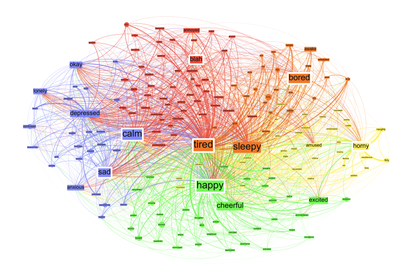

### Agenda 

1. Introduction to Sentiment Analysis
2. Sentiment Analysis & Modeling in R 

# Introduction to Sentiment Analysis 

## What is Sentiment Analysis?

- Task/research field in Natural Language Processing (NLP) since ca. 2000

- Is this piece of language positive or negative in sentiment? Thumbs up or thumbs down?

- ``Sentiment analysis, also called opinion mining, is the field of study that
analyzes people’s opinions, sentiments, appraisals, attitudes, and emotions
toward entities and their attributes expressed in [language]. The entities can
be products, services, organizations, individuals, events, issues, or topics.'' (Liu 2020) 

- Usually written text, but also work being done using different types of input data: images, videos, and audio  

- Other names (but subtly different tasks): opinion mining, opinion analysis, opinion extraction, sentiment mining, subjectivity analysis, affect analysis, emotion analysis, and review mining 

- Task setup:
  * Most typically a binary classification task: positive vs. negative 
  * Occasionally ordinal (e.g. star ratings; negative/neutral/positive; very negative---very positive; etc.) 


## Stuff that Falls Under Sentiment Analysis

- subjectivity detection (Pang and Lee 2004) 
- hawkishness/dovishness (Tobback et al. 2017)
- toxic language detection (Zhou et al. 2021)
- fake news detection  (Oshikawa et al. 2020)
- stance detection (Anand et al. 2011) 
- rumor detection (Ma et al. 2018) 
- polarization (Demszky et al. 2019)


## Applications 

### General

- businesses:
  * what are customers saying about their products and services? 
  * tweet sentiment used to predict movie revenues 
- consumers:
  * holidaymakers want to know whether they should this or that hotel 
  * product reviews used to rank products and merchants (McGlohon et al. 2010)
- governments and decision-making institutions:
   * what are public opinions about existing or proposed policies? 
- political elections (e.g., Bermingham and Smeaton 2011)
  * what are people's opinions about electoral candidates? 
  * positive/negative tweets used to train a linear regression model to predict election results (Bermingham and Smeaton 2011)
  
  


### CB & EconFin

- stock market prediction (Das and Chen 2007)
- regulatory communications to failing firms (Bholat et al. 2017)
- sentiment gap between market participants' views and those of the MPC (with Carlos Canon)
- measuring news sentiment (Turrell et al.; Shapiro et al.) forcasting 


## Levels of Sentiment Analysis

### Document Level

- classify whether a whole document expresses a positive or negative sentiment 
- e.g. given a product review, the sentiment analysis system determines whether the whole review expresses an overall positive or negative opinion about the product
- problem:
    * assumes each document is about a single entity
    * so difficult to extract reasons 

### Sentence Level

- classify whether a sentence expresses a positive, neutral, or negative opinion 
- similar problems as with document-level analysis:
    * e.g. *The food arrived cold, but the service was fast*
    

### Aspect (Target/Feature/Entity) Level

- often want to know what each sentiment/opinion is about 

- takes a document and extracts all (aspect, sentiment) pairs 
    * e.g. *Apple is doing well in this poor economy*
        * (Apple, positive), (economy in general, negative)
        
- or we could go even more fine-grained
    * E.g. ``When I arrived, I was so upset with the manager of the hotel''
      +  entity - hotel
      + stimulus - manager of the hotel
      + emotion - anger
      + experiencer - the speaker/writer
      + time - upon arrival 
      
- problem:
    * a bit more involved, need two systems - one to extract aspects, another to classify sentiment 

## Issues in Sentiment Analysis

### Affective Computing 

image:  
(Sudhof et al. )

### Language Use

1. There was an earthquake in California / on Mars 
2. This phone sucks 
3.
  (a) Can you recommend a good camera?
  (b) Do you know a place where I can get this rubbish camera fixed?  
4. This camera cost an arm and a leg 
5. Many said this movie would be...  It was terrible. 
6. Coke tastes better than Pepsi 
7. The team failed to complete the challenge. (We win/lose!)
8. I'm so upset that X's share price has gone up
9. I did not love that movie 


## Approaches

### Lexicon-Based Approaches

- Use an existing sentiment lexicon or induce one from the data
    * [Bing Liu](https://www.cs.uic.edu/~liub/FBS/sentiment-analysis.html)'s lexicon
    * [Loughran and McDonald](https://sraf.nd.edu/loughranmcdonald-master-dictionary/) (EconFin)
    * [Harvard General Inquirer](http://www.mariapinto.es/ciberabstracts/Articulos/Inquirer.htm)
    * [Warriner et al.'s affective ratings](http://crr.ugent.be/archives/1003)
- Many available in R via (e.g.) `tidytext::get_sentiments(lexicon = c("bing", "loughran"))`
- Use some kind of scoring function, e.g: 

$$
sentimentScore = \frac{count(pos, doc) - count(neg, doc)}{count(words, doc)} 
$$

$$
sentimentClass =
\begin{cases}
 +, ,& sentimentScore > 0 \\
 -  ,& sentimentScore \leq 0
 \end{cases}       
$$

### Traditional Supervised Sentiment Analysis

- Take some sparse, high-dimensional bag-of-words/handcrafted feature representation of the text 
- Feed in $(representation, label)$ pairs into some traditional ML algorithm:
  * naive Bayes
  * logistic regression (usually needs to be regularized because of vast feature spaces)
  * random forest
  * SVM 
  * ...
- Same as any other ML problem (hyperparameter tuning, feature ablation experiments, ...)

### Features in Traditional Supervised Sentiment Analysis

- bag-of-words: 

```{r echo=T, message = FALSE} 
library(tidyverse)
library(textrecipes)
tibble(label = c("neg", "pos"), 
       text = c("This movie was boring", "This book was really interesting")) %>%
         recipe(label ~ text) %>%
         step_tokenize(text) %>%
         step_tf(text) %>%
         prep() %>%
         bake(new_data = NULL)
         
```

### Features in Traditional Supervised Sentiment Analysis

- handcrafted features (depends on the application/domain):

  * repeated exclamation marks `This movie was awful!!!!!!`
  * all caps, `This movie was AWFUL`
  * emojis, `This book was great :)`
  * word lengthening `It was so booooorrrring`
  * POS-tags
  * syntactic dependency parses 
  * .... 


### Neural Supervised Sentiment Analysis

- Take some dense, low-dimensional  representation of the text
- Feed in $(representation, label)$ pairs into a neural network of some kind:
    - feed-forward neural networks
    - convolutional neural networks
    - recurrent neural networks (RNNs, LSTMs)
    - transformer-based models (e.g. BERT)

### Features in Neural Supervised Sentiment Analysis

```{r}
glove_embeddings <- read_delim("data/glove6b100d.txt", delim = "\t")
head(glove_embeddings)
```

### Features in Neural Supervised Sentiment Analysis


```{r echo=T, message = FALSE} 
tibble(label = c("neg", "pos"), 
       text = c("This movie was boring", "This book was really interesting")) %>%
         recipe(label ~ text) %>%
         step_tokenize(text) %>%
         step_word_embeddings(text, embeddings = glove_embeddings ) %>%
         prep() %>%
         bake(new_data = NULL)
         
```


<!-- # Sentiment Analysis in R  -->

<!-- ## Preliminaries  -->

<!-- ### Packages -->

<!-- - Make sure that you have the following packages installed, which you can do with `install.packages(c("tidyverse", "arrow", "glmnet", ...))`  -->

<!-- ```{r echo=T, results='hide', message = FALSE} -->
<!-- library(tidyverse) -->
<!-- library(arrow) -->
<!-- library(tidytext) -->
<!-- library(tokenizers) -->
<!-- library(yardstick) -->
<!-- library(tidymodels) -->
<!-- library(textrecipes) -->
<!-- library(glmnet) -->
<!-- library(textfeatures) -->
<!-- ``` -->

<!-- ### Plot options  -->

<!-- - Colors for the plots -->
<!-- ```{r} -->
<!-- POS_COLOR <- "#03a5fc" # bluey color  -->
<!-- NEG_COLOR <- "#fca503" #orangey color  -->
<!-- ``` -->
<!-- - Transparency of fills -->
<!-- ```{r} -->
<!-- ALPHA <- 0.6 -->
<!-- ``` -->

<!-- ### Problem Definition -->

<!-- - To build a performant sentiment analysis system that classifies movie reviews as `positive` or `negative` -->
<!-- - Some requirements: -->
<!--   - Training data pairs (and test data for evaluation) -->
<!--     - each pair being $(text,label)$ -->
<!--   - Featurization method:  -->
<!--     - $\phi : text \rightarrow features$ -->
<!--   - Evaluation metric:  -->
<!--     - e.g. accuracy, $F_1$, AUROC, ... -->
<!--   - Model:  -->
<!--     - $h : features \rightarrow label \in \{positive,negative\}$ -->

<!--     - e.g. hand-crafted rules, logistic regression, random forest, FFNN, ...  -->

<!-- ## Data and Data Exploration -->

<!-- ### Data -->

<!-- - sample of [Maas et al. (2011)](https://ai.stanford.edu/~ang/papers/acl11-WordVectorsSentimentAnalysis.pdf) IMDB dataset -->
<!-- - original dataset contains: -->
<!--   - 25,000 labeled training observations -->
<!--   - 25,000 labeled test observations -->
<!--   - 50,000 unlabeled observations -->
<!-- - our version of their dataset:  -->
<!--   - sample of 10,000 of their labeled training observations -->
<!--   - sample further split 60/20/20 into pseudo train/dev/test set  -->
<!--   - duplicates have been removed, but the text has otherwise not been preprocessed -->

<!-- ### Data Read-In  -->

<!-- ```{r eval=TRUE} -->
<!-- imdb <- arrow::read_parquet("data/imdb-sample.parquet") -->
<!-- str(imdb) -->
<!-- ``` -->

<!-- ### Split Distributions  -->

<!-- ```{r} -->
<!-- imdb %>% count(split)  -->
<!-- ``` -->
<!-- ### Label distributions by split  -->

<!-- ```{r} -->
<!-- imdb %>%  -->
<!--   group_by(split, label) %>%  -->
<!--   summarise(value_counts = n()) %>% -->
<!--   mutate(`normalized_counts (%)` = round((value_counts / sum(value_counts) * 100), 2) -->
<!--          ) -->
<!-- ``` -->

<!-- ### Split train/dev/test into separate dataframes -->

<!-- ```{r} -->
<!-- train_imdb <- imdb %>% filter(split == "train") %>% dplyr::select(text, label) -->
<!-- dev_imdb <- imdb %>% filter(split == "dev") %>% dplyr::select(text, label) -->
<!-- test_imdb <- imdb %>% filter(split == "test") %>% dplyr::select(text, label) -->
<!-- ``` -->

<!-- ### A note on train/dev/splits and data hygiene  -->

<!-- - The **train** set is used to find the optimal model parameters according to the model's cost function  -->
<!-- - The **dev** set is used to find the optimal model hyperparameters (e.g., number of units in a NN layer) and other external settings (e.g, such as scaling choices, feature sets, ) -->
<!--   - N.B. (1) you could use CV here instead or as well as a dev set -->
<!--   - N.B. (2) the more you peak into the dev set, the more likely you will overfit to that too; so sometimes it's useful to have dev1 (for tuning hyperparameters), dev2 (for measuring overall progress), ... depending on how many experiments you're going to run  -->
<!-- - The **test** set is used for final evaluation  -->
<!-- - More useful remarks from the Stanford NLP group [here](https://web.stanford.edu/class/archive/cs/cs224n/cs224n.1194/readings/final-project-practical-tips.pdf) -->

<!-- ### Some Examples of Reviews -->

<!-- ```{r} -->
<!-- # 5 examples of positive reviews  -->
<!-- set.seed(123) -->
<!-- train_imdb %>% -->
<!--   filter(label == "pos") %>% -->
<!--   sample_n(3) %>% -->
<!--   pull(text) -->
<!-- ``` -->

<!-- ```{r} -->
<!-- # 5 examples of negative reviews  -->
<!-- set.seed(123) -->
<!-- train_imdb %>% -->
<!--   filter(label == "neg") %>% -->
<!--   sample_n(3) %>% -->
<!--   pull(text) -->
<!-- ``` -->

<!-- ### Mark-up and Text Cleaning  -->

<!-- - Presence of things like `\u0085` and `<br />` -->
<!-- - May want to remove these  -->

<!-- ```{r} -->
<!-- simple_clean <- function(text){ -->
<!--   str_replace_all(text, '\u0085|<br />', '') -->
<!-- } -->

<!-- simple_clean("or something?\u0085<br /><br />") -->
<!-- ``` -->

<!-- - I'll deal with this and related issues properly later  -->

<!-- ### Tokenization and Review Length  -->

<!-- - How long are the reviews?  And are length distributions different by label?   -->
<!-- - Need to define some measure of length: characters, words, etc. -->
<!-- - If words, we need to define what we mean by a 'word'  -->

<!-- ```{r fig.width=5, fig.height=2} -->
<!-- # get the review legnths  -->
<!-- review_lengths <- lengths(tokenize_words(train_imdb$text), use.names = F) -->
<!-- # stick into a dataframe -->
<!-- review_lengths_labels_df <- tibble(label = train_imdb$label, number_of_words = review_lengths) -->
<!-- # plot counts by label  -->
<!-- review_lengths_labels_df %>% ggplot(aes(x = number_of_words, fill = label)) + -->
<!--   geom_histogram(bins = 50, alpha = 0.7) -->
<!-- ``` -->
<!-- ### Negation Rates (1) -->

<!-- - How frequently does clausal negation occur?  Are there differences by label?   -->

<!-- ```{r} -->
<!-- # get negative rates for each review (in number of words per million) -->

<!-- list_of_negatives <- c("not", "never", "no", "nowhere", "nobody", "yet", "hardly", "barely") -->
<!-- contracted_negative_pattern <- "n't" -->

<!-- mean_negative_rate <- train_imdb %>%  -->
<!--                         mutate(review_id = 1:nrow(train_imdb)) %>% -->
<!--                         unnest_tokens(words, text) %>% -->
<!--                         mutate(is_negative = (words %in% list_of_negatives)| -->
<!--                                  str_detect(words, contracted_negative_pattern)) %>% -->
<!--                         select(review_id, is_negative) %>% -->
<!--                         group_by(review_id) %>% -->
<!--                         summarize(mean_negative_rate = mean(is_negative)) %>% -->
<!--                         mutate(mean_negative_rate = mean_negative_rate * 10^6) %>% -->
<!--                         select(mean_negative_rate) -->

<!-- mean_negative_rate_df <- tibble(mean_negative_rate, label = train_imdb$label) -->

<!-- ``` -->

<!-- ### Negation Rates (2) -->

<!-- - How frequently does clausal negation occur?  Are there differences by label?   -->

<!-- ```{r fig.width=5, fig.height=2} -->
<!-- mean_negative_rate_df %>% ggplot(aes(x = mean_negative_rate, fill = label)) + -->
<!--   geom_histogram(bins = 50, alpha = 0.7) -->
<!-- ``` -->

<!-- ### Handling negation  -->

<!-- - Given that negation is quite frequent, it should be flagged: -->
<!--     - I really did not like that movie $\rightarrow$ I really did not like that movie -->
<!-- - A good baseline is to use Das's approach..  -->

<!-- ### Words that distinguish the classes (1) -->

<!-- ```{r} -->
<!-- pos_neg_ratio_df <- train_imdb %>% -->
<!--   unnest_tokens(word, text) %>% -->
<!--   group_by(label) %>% -->
<!--   count(word, sort = TRUE) %>% -->
<!--   filter(n > 25) %>% -->
<!--   pivot_wider(names_from = label, values_from = n) %>% -->
<!--   mutate(pos = replace_na(pos, 1) + 1, neg = replace_na(neg, 1) + 1) %>% -->
<!--   mutate(pos_neg_ratio = log(pos/neg)) %>% -->
<!--   arrange(desc(pos_neg_ratio))  -->

<!-- head(pos_neg_ratio_df) -->
<!-- ``` -->

<!-- ### Words that distinguish the classes (2) -->

<!-- ```{r fig.width=5, fig.height=2} -->
<!-- pos_neg_ratio_df %>% -->
<!--   head(10) %>% -->
<!--   ggplot(aes(x = reorder(word, pos_neg_ratio), y = pos_neg_ratio)) + -->
<!--   geom_bar(stat = "identity", fill = POS_COLOR, alpha = 0.7) + -->
<!--   coord_flip() + -->
<!--   labs(x="", y = "log[count(positive+1)/count(negative+1)]",  -->
<!--        title = "words associated with +'ve reviews")  -->
<!-- ``` -->


<!-- ### Words that distinguish the classes (3) -->

<!-- ```{r fig.width=5, fig.height=2} -->
<!-- pos_neg_ratio_df %>% -->
<!--   tail(10) %>% -->
<!--   ggplot(aes(x = reorder(word, -pos_neg_ratio), y = pos_neg_ratio)) + -->
<!--   geom_bar(stat = "identity", fill = NEG_COLOR, alpha = 0.7) + -->
<!--   coord_flip() + -->
<!--   labs(x="", y = "log[count(positive+1)/count(negative+1]",  -->
<!--        title = "words associated with -'ve reviews")  -->
<!-- ``` -->

<!-- ## Evaluation Metric -->

<!-- How are we going to decide whether our system is performant or not? Accuracy is often used.  We will use Macro F1 as that is fairly common in NLP, but you should be aware that other metrics (Brier, AUROC, ...) might be more appropriate for the problem.   -->

<!-- This is available in the `yardstick` package as `f_meas(estimator = "macro")` or `f_meas_vec(estimator = "macro")`, depending on how your results are structured:  -->

<!-- ```{r} -->
<!-- # make up some data and fake predictions   -->
<!-- y_true <- factor(c(1,1,1,1,1,0,0,0,0,0)) -->
<!-- y_pred <- factor(c(0,1,1,0,0,1,1,1,1,0)) -->

<!-- # if your results are in a dataset  -->
<!-- results <- tibble(y_true, y_pred) -->
<!-- f_meas(results, y_true, y_pred, estimator = "macro") -->

<!-- # as vectors  -->
<!-- f_meas_vec(y_true, y_pred, estimator = "macro") -->
<!-- ``` -->
<!-- ```{r} -->
<!-- ### Evaluation Metrics -->
<!-- #### F1 wrapper -->
<!-- f1_meas_macro <- function(data, truth, estimate, na_rm = TRUE, ...) { -->
<!--  f1_meas( -->
<!--     data = data, -->
<!--     truth = !! rlang::enquo(truth), -->
<!--     estimate = !! rlang::enquo(estimate), -->
<!--     estimator = "macro", -->
<!--     ... -->
<!--   ) -->
<!-- } -->


<!-- ``` -->


<!-- ## Models  -->

<!-- - Recall here we will look at: -->
<!--     1. a lexicon+rule based approach -->
<!--     2. a traditional machine learning approach (& comparing models) -->
<!--           + unigrams + logistic regression -->
<!--           + unigrams + bigrams + logistic regression -->
<!--           + handcrafted features  -->
<!--     3. a simple feed-forward neural network approach -->

<!-- ### Lexicon + Rule Based Approach (1) -->
<!-- #### Lexicon  -->

<!-- We use Bing Liu's lexicon, available in the `tidytext` package with the following call:  -->
<!-- ```{r} -->
<!-- liu_lex <- get_sentiments("bing") -->
<!-- head(liu_lex) -->
<!-- ``` -->

<!-- ```{r} -->
<!-- liu_lex %>%  -->
<!--   count(sentiment) -->
<!-- ``` -->

<!-- There's a variation of it, containing 2003 positive words and 4780 negative words, in the project folder. This version has a few duplicates and words that occur in both positive and negative lists.  -->

<!-- ### Constructing the sentiment Rule -->

<!-- ```{r} -->
<!-- get_sentiment_score <- function(data){ -->
<!--   tokens <- unlist(tokenize_words(data)) -->
<!--   tokens_df <- tibble(word = tokens) -->
<!--   sentiment_tokens <- inner_join(tokens_df, liu_lex, by = "word") -->
<!--   sentiment_tokens$sentiment <- recode(sentiment_tokens$sentiment, "positive" = 1, "negative" = 0) -->
<!--   score <- mean(sentiment_tokens$sentiment)  -->
<!--   if (is.nan(score)){ -->
<!--     return(sample(c("pos", "neg"), 1)) -->
<!--      } -->
<!--   else if (score > 0.5){ -->
<!--     return("pos") -->
<!--     }  -->
<!--   else { -->
<!--     return("neg") -->
<!--     } -->
<!--   } -->
<!-- ``` -->

<!-- ### Applying the sentiment rule -->

<!-- There is no training to be done, because we used a hand-crafted rule, so we can apply directly to the `train` and `dev` sets and get some scores...  -->

<!-- ```{r} -->
<!-- # for the training data  -->
<!-- train_lexicon_preds <- sapply(train_imdb$text, get_sentiment_score, USE.NAMES = FALSE)  -->
<!-- train_lexicon_result <- f_meas_vec(factor(train_imdb$label), factor(train_lexicon_preds),  -->
<!--                                    estimator = "macro") -->
<!-- sprintf("Train macro F1 using lexicon approach: %.4f", train_lexicon_result) -->
<!-- ``` -->


<!-- ```{r} -->
<!-- # for the test data  -->
<!-- dev_lexicon_preds <- sapply(dev_imdb$text, get_sentiment_score, USE.NAMES = FALSE)  -->
<!-- dev_lexicon_result <- f_meas_vec(factor(dev_imdb$label), factor(dev_lexicon_preds),  -->
<!--                                  estimator = "macro") -->
<!-- sprintf("Dev  macro F1 using lexicon approach: %.4f", dev_lexicon_result) -->
<!-- ``` -->

<!-- ## Traditional Machine Learning  -->
<!-- ### Unigram  -->
<!-- #### Preprocessing  -->

<!-- ### Unigram  -->
<!-- #### Preprocessing  -->

<!-- ```{r} -->
<!-- # set up preprocessing  -->

<!-- # recipe -->
<!-- ridge_uni_rec <- recipe(label ~ text, data = train_imdb) %>% -->
<!--     step_tokenize(text) %>% -->
<!--     step_tokenfilter(text, max_tokens = 5000) %>%  -->
<!--     step_tf(text) %>% -->
<!--     step_normalize(all_predictors()) -->

<!-- # evaluate the recipe  -->
<!-- ridge_uni_prep <- prep(ridge_uni_rec) -->

<!-- # inspect it  -->
<!-- bake(ridge_uni_prep, new_data = NULL) -->
<!-- ``` -->

<!-- ### Unigram  -->
<!-- #### Model set up -->

<!-- ```{r} -->
<!-- ridge_uni_spec <- logistic_reg(penalty = tune(), mixture = 0) %>% -->
<!--   set_engine("glmnet") -->

<!-- ridge_uni_wf <- workflow() %>% -->
<!--   add_recipe(ridge_uni_rec) %>% -->
<!--   add_model(ridge_uni_spec) -->

<!-- ridge_uni_wf -->
<!-- ``` -->

<!-- ### Unigram  -->
<!-- #### Model tuning  -->

<!-- ```{r} -->
<!-- # set of possible regularization parameters to try -->
<!-- lambda_grid <- grid_regular(penalty(), levels = 25) -->
<!-- ``` -->

<!-- ```{r} -->
<!-- # set of resampled data to fit and evaluate all these models -->
<!-- set.seed(123) -->
<!-- imdb_train_folds <- vfold_cv(train_imdb, v = 3) # 3-fold CV  -->
<!-- # imdb_train_folds <- bootstraps(train_imdb, times = 3, strata = label) # bootstrap approach -->
<!-- imdb_train_folds -->
<!-- ``` -->

<!-- ### -->
<!-- ```{r} -->
<!-- doParallel::registerDoParallel() -->

<!-- set.seed(123) -->
<!-- ridge_uni_grid <- tune_grid( -->
<!--   ridge_uni_wf, -->
<!--   resamples = imdb_train_folds, -->
<!--   grid = lambda_grid, -->
<!--   metrics = metric_set(f_meas) -->
<!-- ) -->

<!-- ``` -->

<!-- ###  -->
<!-- ```{r} -->
<!-- ridge_uni_grid %>% -->
<!--   collect_metrics() -->
<!-- ``` -->


<!-- ```{r} -->
<!-- ridge_uni_grid %>% -->
<!--   collect_metrics() %>% -->
<!--   ggplot(aes(penalty, mean)) + -->
<!--   geom_line(size = 1.5, show.legend = FALSE) + -->
<!--   scale_x_log10() -->
<!-- ``` -->
<!-- ### Unigram  -->
<!-- #### Refit the model according to optimal lambda value -->

<!-- ```{r} -->
<!-- best_f1 <- ridge_uni_grid %>% -->
<!--   select_best("f_meas") -->

<!-- ridge_uni_final <- finalize_workflow(ridge_uni_wf, best_f1) -->

<!-- ridge_uni_final_model <- fit(ridge_uni_final, train_imdb) -->
<!-- ``` -->

<!-- ### Unigram  -->
<!-- #### Evaluate  -->

<!-- ```{r} -->
<!-- ridge_uni_train_preds <- predict(ridge_uni_final_model, train_imdb) -->
<!-- ridge_uni_train_result <- f_meas_vec(factor(train_imdb$label), ridge_uni_train_preds$.pred_class,  -->
<!--                                    estimator = "macro") -->
<!-- sprintf("Train macro F1 using unigrams in logit: %.4f", ridge_uni_train_result) -->
<!-- ``` -->
<!-- ```{r} -->
<!-- ridge_uni_dev_preds <- predict(ridge_uni_final_model, dev_imdb) -->
<!-- ridge_uni_dev_result <- f_meas_vec(factor(dev_imdb$label), ridge_uni_dev_preds$.pred_class,  -->
<!--                                    estimator = "macro") -->
<!-- sprintf("Dev macro F1 using unigrams in logit: %.4f", ridge_uni_dev_result) -->
<!-- ``` -->


<!-- ### Unigrams (Stemmed) -->
<!-- #### Preprocessing  -->

<!-- ```{r} -->
<!-- # set up preprocessing  -->

<!-- # recipe -->
<!-- ridge_uni_stemmed_rec <- recipe(label ~ text, data = train_imdb) %>% -->
<!--     step_tokenize(text) %>% -->
<!--     step_stem(text) %>% -->
<!--     step_tokenfilter(text, max_tokens = 5000) %>%  -->
<!--     step_tf(text) %>% -->
<!--     step_normalize(all_predictors()) -->

<!-- # evaluate the recipe  -->
<!-- ridge_uni_stemmed_prep <- prep(ridge_uni_stemmed_rec) -->

<!-- # inspect it  -->
<!-- bake(ridge_uni_stemmed_prep, new_data = NULL) -->
<!-- ``` -->

<!-- ### Unigram  -->
<!-- #### Model set up -->

<!-- ```{r} -->
<!-- ridge_uni_stemmed_spec <- logistic_reg(penalty = tune(), mixture = 0) %>% -->
<!--   set_engine("glmnet") -->

<!-- ridge_uni_stemmed_wf <- workflow() %>% -->
<!--   add_recipe(ridge_uni_stemmed_rec) %>% -->
<!--   add_model(ridge_uni_stemmed_spec) -->

<!-- ridge_uni_stemmed_wf -->
<!-- ``` -->

<!-- ### Unigram  -->
<!-- #### Model tuning  -->

<!-- ```{r} -->
<!-- # set of possible regularization parameters to try -->
<!-- lambda_grid <- grid_regular(penalty(), levels = 25) -->
<!-- ``` -->

<!-- ```{r} -->
<!-- # set of resampled data to fit and evaluate all these models -->
<!-- set.seed(123) -->
<!-- imdb_train_folds <- vfold_cv(train_imdb, v = 3) # 3-fold CV  -->
<!-- # imdb_train_folds <- bootstraps(train_imdb, times = 3, strata = label) # bootstrap approach -->
<!-- imdb_train_folds -->
<!-- ``` -->

<!-- ### -->
<!-- ```{r} -->
<!-- doParallel::registerDoParallel() -->

<!-- set.seed(123) -->
<!-- ridge_uni_stemmed_grid <- tune_grid( -->
<!--   ridge_uni_stemmed_wf, -->
<!--   resamples = imdb_train_folds, -->
<!--   grid = lambda_grid, -->
<!--   metrics = metric_set(f_meas) -->
<!-- ) -->

<!-- ``` -->

<!-- ###  -->
<!-- ```{r} -->
<!-- ridge_uni_stemmed_grid %>% -->
<!--   collect_metrics() -->
<!-- ``` -->


<!-- ```{r} -->
<!-- ridge_uni_stemmed_grid %>% -->
<!--   collect_metrics() %>% -->
<!--   ggplot(aes(penalty, mean)) + -->
<!--   geom_line(size = 1.5, show.legend = FALSE) + -->
<!--   scale_x_log10() -->
<!-- ``` -->
<!-- ### Unigram  -->
<!-- #### Refit the model according to optimal lambda value -->

<!-- ```{r} -->
<!-- best_f1 <- ridge_uni_stemmed_grid %>% -->
<!--   select_best("f_meas") -->

<!-- ridge_uni_stemmed_final <- finalize_workflow(ridge_uni_stemmed_wf, best_f1) -->

<!-- ridge_uni_stemmed_final_model <- fit(ridge_uni_stemmed_final, train_imdb) -->
<!-- ``` -->

<!-- ### Unigram  -->
<!-- #### Evaluate  -->

<!-- ```{r} -->
<!-- ridge_uni_stemmed_train_preds <- predict(ridge_uni_stemmed_final_model, train_imdb) -->
<!-- ridge_uni_stemmed_train_result <- f_meas_vec(factor(train_imdb$label), ridge_uni_stemmed_train_preds$.pred_class,  -->
<!--                                    estimator = "macro") -->
<!-- sprintf("Train macro F1 using unigrams in logit: %.4f", ridge_uni_stemmed_train_result) -->
<!-- ``` -->
<!-- ```{r} -->
<!-- ridge_uni_stemmed_dev_preds <- predict(ridge_uni_stemmed_final_model, dev_imdb) -->
<!-- ridge_uni_stemmed_dev_result <- f_meas_vec(factor(dev_imdb$label), ridge_uni_stemmed_dev_preds$.pred_class,  -->
<!--                                    estimator = "macro") -->
<!-- sprintf("Dev macro F1 using unigrams in logit: %.4f", ridge_uni_stemmed_dev_result) -->
<!-- ``` -->

<!-- ### An alternative model  -->

<!-- ### Unigram BoW Random Forest  -->
<!-- #### Preprocessing  -->

<!-- ```{r} -->
<!-- # set up preprocessing  -->

<!-- # recipe -->
<!-- rf_uni_rec <- recipe(label ~ text, data = train_imdb) %>% -->
<!--     step_tokenize(text) %>% -->
<!--     step_tokenfilter(text, max_tokens = 5000) %>%  -->
<!--     step_tf(text) %>% -->
<!--     step_normalize(all_predictors()) -->

<!-- # evaluate the recipe  -->
<!-- rf_uni_prep <- prep(rf_uni_rec) -->

<!-- # inspect it  -->
<!-- bake(rf_uni_prep, new_data = NULL) -->
<!-- ``` -->

<!-- ### Unigram  -->
<!-- #### Model set up -->

<!-- ```{r} -->
<!-- # rf_uni_spec <- rand_forest(mode = "classification",  -->
<!-- #                            engine = "ranger",  -->
<!-- #                            mtry = floor(sqrt(5000))) -->

<!-- rf_uni_spec <- svm_linear(mode = "classification") -->

<!-- rf_uni_wf <- workflow() %>% -->
<!--   add_recipe(rf_uni_rec) %>% -->
<!--   add_model(rf_uni_spec) -->

<!-- rf_uni_wf -->
<!-- ``` -->

<!-- ```{r} -->
<!-- rf_uni_model <- fit(rf_uni_wf, train_imdb) -->
<!-- ``` -->

<!-- ### Unigram  -->
<!-- #### Evaluate  -->

<!-- ```{r} -->
<!-- rf_uni_train_preds <- predict(rf_uni_model, train_imdb) -->
<!-- rf_uni_train_result <- f_meas_vec(factor(train_imdb$label), rf_uni_train_preds$.pred_class,  -->
<!--                                    estimator = "macro") -->
<!-- sprintf("Train macro F1 using unigrams in RF: %.4f", rf_uni_train_result) -->
<!-- ``` -->
<!-- ```{r} -->
<!-- rf_uni_dev_preds <- predict(rf_uni_model, dev_imdb) -->
<!-- rf_uni_dev_result <- f_meas_vec(factor(dev_imdb$label), rf_uni_dev_preds$.pred_class,  -->
<!--                                    estimator = "macro") -->
<!-- sprintf("Dev macro F1 using unigrams in RF: %.4f", rf_uni_dev_result) -->
<!-- ``` -->


<!-- ```{r} -->
<!-- # set up preprocessing  -->

<!-- # recipe -->
<!-- rf_uni_rec <- recipe(label ~ text, data = train_imdb) %>% -->
<!--     step_tokenize(text) %>% -->
<!--     step_tokenfilter(text, max_tokens = 5000) %>%  -->
<!--     step_tf(text) %>% -->
<!--     step_normalize(all_predictors()) -->

<!-- # evaluate the recipe  -->
<!-- rf_uni_prep <- prep(rf_uni_rec) -->

<!-- # inspect it  -->
<!-- bake(rf_uni_prep, new_data = NULL) -->
<!-- ``` -->
